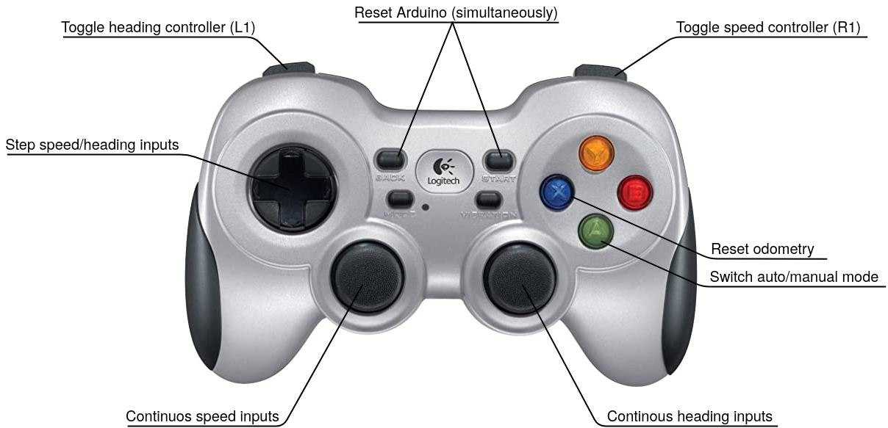

# robotball_driver

A package for driving and interfacing with the robot.

### Usage
Start the driver with `roslaunch robotball_driver driver.launch`. This starts a node for serial communication with Arduino and a node that reads inputs from joystick, parses incoming messages, and serves as a dynamic reconfigure server for changing PID parameters on the fly.

In addition:
- Start the joystick driver on your computer: `rosrun joy joy_node`
- Start rqt dynamic reconfigure: `rosrun rqt_reconfigure rqt_reconfigure`

### Joystick button mapping (Logitech F710)

